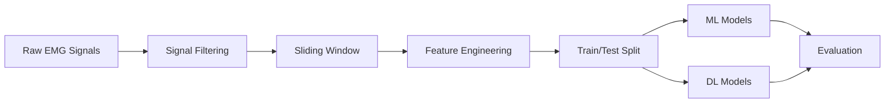

<!-- ================= HEADER ================= -->

<h1 align="center">🧠 EMG Hand Gesture Classification</h1>

<p align="center">
  <b>Transforming Muscle Signals into Intelligent Gesture Predictions</b><br>
  <i>Machine Learning • Deep Learning • Signal Processing</i>
</p>

<p align="center">
  
  
  
  
</p>

---

## 🚀 Overview

> A complete end-to-end system that classifies hand gestures using **EMG (Electromyography) signals**.
> Converts raw muscle activity into actionable predictions using advanced ML & DL models.

---

## ⚡ Key Features

```bash
✔ 16-channel EMG signal processing
✔ Bandpass filtering (20–90 Hz)
✔ Sliding window segmentation (1 sec, 87.5% overlap)
✔ 192-dimensional feature engineering
✔ ML + DL model comparison
✔ High accuracy (~96%) achieved
```

---

## 🧩 Pipeline



---

## 🔬 Data Details

```yaml
Dataset: NinaPro DB
Channels: 16 EMG sensors
Sampling Rate: 200 Hz
Window Size: 200 samples (1 sec)
Step Size: 25 (87.5% overlap)
```

---

## 📊 Feature Engineering

```python
# Example feature vector (192 features per window)
features = [
    MAV, RMS, Variance, ZeroCrossings,
    WaveformLength, Skewness, Kurtosis,
    MeanFrequency, MedianFrequency, PeakPower
]
```

✔ Total Features = **12 features × 16 channels = 192**

---

## 🤖 Models Used

### 🔹 Machine Learning

```bash
- SVM (Best Performer 🚀)
- Random Forest
- KNN
- LDA
```

### 🔹 Deep Learning

```bash
- CNN (1D Convolution)
- LSTM
- CNN-LSTM Hybrid
```

---

## 📈 Results

```diff
+ SVM Accuracy           : ~96%
+ Random Forest Accuracy : ~96%
+ CNN Accuracy           : ~92%
- LSTM Accuracy          : ~85%
```

---

## 📊 Evaluation Metrics

```python
Accuracy        # Overall correctness
F1 Score        # Balance of precision & recall
ConfusionMatrix # Class-wise performance
CrossValidation # Reliability check (10-fold)
```

---

## 🎯 Key Insights

```bash
✔ Feature engineering > Raw deep learning (for small data)
✔ Signal preprocessing significantly boosts accuracy
✔ High overlap → more training data → better performance
✔ Classical ML outperforms DL in limited data scenarios
```

---

## ⚙️ Tech Stack

```bash
Python
NumPy, Pandas
Scikit-learn
TensorFlow / Keras
SciPy
Matplotlib, Seaborn
```

---

## 📂 Project Structure

```bash
📁 EMG-Classifier
 ┣ 📂 data
 ┣ 📂 notebooks
 ┣ 📂 models
 ┣ 📜 main.py
 ┣ 📜 requirements.txt
 ┗ 📜 README.md
```

---

## 🌍 Applications

```bash
✔ Prosthetic Hand Control
✔ Gesture Recognition Systems
✔ Human-Computer Interaction
✔ Biomedical Signal Analysis
```

---

## 🧠 Key Achievement

```diff
- Previous Accuracy : ~66%
+ Improved Accuracy : ~96%

Reason:
✔ Optimized sliding window step size
✔ Increased training samples
✔ Better feature representation
```

---

## 👨‍💻 Author

**Vikas Shakalya**
🚀 AI Researcher | Founder @ Shakalya International

---

## ⭐ Support

If you like this project:

```bash
⭐ Star this repository
🍴 Fork it
📢 Share with others
```

---
